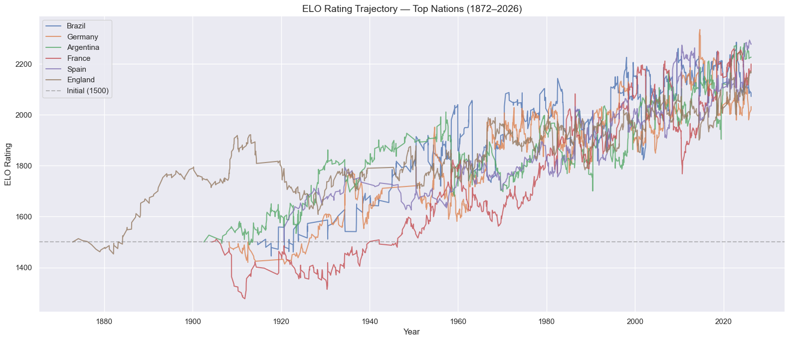
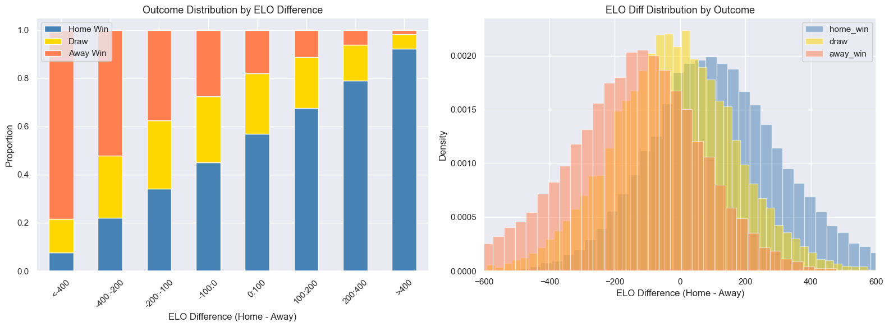

# 03 — Feature Engineering: Findings & Decisions

This document captures what each step did, why, what it found, and what it means for model training.

---

## Cell 1: Imports & Setup

**Why:** Load libraries. `defaultdict` is used for ELO and H2H state tracking — faster than checking for key existence on every match iteration.

---

## Cell 2: Load Clean Data

**Results:** 60,692 matches loaded, 1872–2026. Sorted chronologically — critical for ELO computation (must process in time order).

---

## Cell 3: ELO Helper Functions

**Why these formulas:**

- `goal_diff_multiplier` — a 1-goal win vs a 5-goal win shouldn't update ELO equally. A blowout win signals stronger dominance and should update ratings more aggressively. Formula from eloratings.net:
  - 1 goal: 1.0x
  - 2 goals: 1.5x
  - 3 goals: 1.75x
  - 4+ goals: 1.75 + (N-3)/8

- `compute_elo` — iterates chronologically, records each team's ELO **before** the match (no leakage), then updates. Home advantage (+100) is only applied on non-neutral ground.

**Test output confirmed correct multipliers:**
- gd=1: 1.000, gd=2: 1.500, gd=3: 1.750, gd=4: 1.875, gd=5: 2.000, gd=7: 2.250 ✓

---

## Cell 4: Run ELO Computation

**Results:**
- 342 teams rated
- Mean ELO: **1500.1** — almost exactly the theoretical mean ✓ (zero-sum system, always converges to 1500 mean)
- ELO range: 759.5 to 2269.6

**Top 20 teams by current ELO:**
1. Spain (2269.6) — strong recent form, Nations League + Euro dominance
2. Argentina (2226.9) — World Cup 2022 winners, Copa América 2024
3. France (2210.9) — consistent top-level performance
4. England (2148.6) — recent Euro finals, strong qualifying
5. Colombia (2096.0) — Copa América 2024 runners-up, 28-match unbeaten run
6. Brazil (2085.9) — historically dominant but recent wobble
7. Portugal (2054.0), Netherlands (2043.8), Japan (2041.4), Germany (2033.6)

**Interesting observations:**
- Colombia at #5 — reflects their extraordinary 2023-2024 form accurately
- Japan at #9 — ELO correctly captures their rise as an Asian powerhouse
- Ecuador at #11 — surprisingly high, but their CONMEBOL form supports it

**Bottom 10:** Small Pacific/Caribbean island nations with almost no competitive history — expected.

---

## Cell 5: ELO Trajectory Chart

**What the chart shows:** ELO ratings for Brazil, Germany, Argentina, France, Spain, England from 1872 to 2026.

**Key observations:**
- All teams start from the baseline 1500 and diverge as data accumulates
- Pre-1930 lines are sparse and noisy (few matches) — ELO hasn't converged yet for this period
- Post-1950 the lines become smooth and meaningful — enough match volume for stable ratings
- **Brazil's dominance** visible as high peaks around 1970 (their golden era — 3 WC wins)
- **Germany's consistency** — rarely drops far, consistently near the top
- **Argentina's rise** — noticeable upward trajectory from 2021 onward (Messi era peak)
- **Spain's peak** 2008–2012 (Euro 2008, WC 2010, Euro 2012 treble) clearly visible
- **England** — consistently solid but no dominant peak compared to others
- The general upward trend for all top nations reflects increasing match density and competitive strength filtering upward

**Confirms ELO is working correctly** — the ratings track known football history accurately.

---

## Cell 6: Save Final ELOs

**Output:** `final_elos.csv` — 342 teams with their ELO rating as of March 2026. This is what we'll use as the starting point for 2026 tournament predictions.

---

## Cell 7: Form Feature Computation

**Why exclude friendlies from form:**
A team's 5 most recent matches should reflect competitive form. If they just played 3 friendly warmup matches, those shouldn't dilute their qualifier/tournament form signal. Research papers confirm competitive-only form is a stronger predictor.

**Design decisions:**
- **Prior for teams with no history:** win_rate=0.5, avg_scored/conceded=1.0, pts=1.0 — neutral priors rather than 0, which would incorrectly penalize new/young nations
- **Tracks `matches_played_N`** — gives the model a confidence weight. If a team only has 2 matches in their last-5 window, that 0.5 win rate is less reliable than a team with 5 matches. Model can learn to discount sparse history.
- **Computed before updating** — the history is updated AFTER recording features for the current match. No leakage.

**Results:** 20 form columns (5 stats × 2 windows × 2 teams)

**Sanity check output (Indonesia vs Thailand, Jan 2022):**
- Thailand's away form: win_rate=0.80, scored=2.40, conceded=0.00 — they were on fire going in
- Indonesia's home form: win_rate=0.40 — moderate. Final result: 2-2. Form was directionally correct.

---

## Cell 8: H2H Feature Computation

**Why H2H matters:** Some matchups have historically lopsided records that aren't captured by either team's general stats. Tactical/stylistic matchup advantages persist across eras (to a degree).

**Design decisions:**
- Tracks all-time H2H and last-5 H2H separately — all-time gives baseline, recent gives current dynamics
- H2H is computed from both directions — whether Brazil was home or away against Argentina, both count toward Argentina's H2H record against Brazil
- `h2h_total_meetings` included as a confidence weight — 2 prior meetings is much less informative than 50

**Results:** 5 H2H columns, mean 13.6 meetings per matchup

**Brazil vs Argentina sanity check:**
- 124 meetings in dataset — most common matchup
- All-time H2H home win rate: 0.366 (from Argentina's perspective as home team — roughly equal record)
- Recent (last 5): 0.600 — Argentina has dominated recently ✓ (consistent with their 2021-2025 dominance)
- Last 5 meetings visible in data: Argentina won 4 of last 5 — ELO and H2H both capture this

---

## Cell 9: Static Features

**Tournament importance (ordinal 0–4):** Captures match stakes. A team playing a World Cup match performs differently than in a friendly — the model can learn to weight high-stakes features more.

**Confederation one-hot:** UEFA and CONMEBOL historically outperform other confederations at World Cups. One-hot encoding lets the model learn these confederation-level strength priors.

**Same confederation flag:** Inter-confederation matchups (e.g., Brazil vs Germany) vs intra-confederation (e.g., Brazil vs Argentina) have different dynamics. Intra-confederation teams have more familiarity with each other's style.

**Results:** 17 static feature columns

---

## Cell 10: Assemble Feature Matrix

**Total:** 60,692 rows × 57 columns (10 meta + 45 features + 2 derived)

**Feature breakdown:**
| Group | Count |
|---|---|
| ELO (home, away, diff) | 3 |
| Form (5+10 windows, 5 stats, 2 teams) | 20 |
| H2H | 5 |
| Static (neutral, tournament, conf, same_conf) | 17 |
| **Total** | **45** |

**Zero null values** — all features complete across all 60k matches ✓

---

## Cell 11: Feature Correlation with Outcome

**Results (sorted by correlation strength):**

| Feature | Correlation |
|---|---|
| `elo_diff` | **+0.476** — strongest single predictor |
| `h2h_home_win_rate` | +0.343 |
| `home_elo_before` | +0.227 |
| `home_pts_per_match_5` | +0.201 |
| `home_win_rate_10` | +0.193 |
| `home_win_rate_5` | +0.178 |
| `neutral` | +0.055 |
| `away_pts_per_match_5` | -0.197 |
| `away_win_rate_10` | -0.196 |
| `away_win_rate_5` | -0.177 |
| `away_elo_before` | -0.266 |

**Key insights:**
- **ELO diff dominates at 0.476** — confirms research paper findings that ELO is the strongest predictor
- **H2H is second at 0.343** — stronger than expected, validates including it
- **Form features (both windows)** each around 0.18–0.20 — meaningful but weaker than ELO
- **Neutral ground at 0.055** — positive correlation means neutral slightly favors home outcome. Makes sense — many neutral ground matches (World Cup, continental tournaments) favor stronger teams, who are often designated "home"
- **Away team stats are mirror negatives** of home team — symmetric and consistent ✓
- The correlation pattern is symmetric between home and away features — confirms no data leakage

---

## Cell 12: ELO vs Outcome Charts

**Left chart — Outcome distribution by ELO diff bucket:**
- When home team has ELO diff > +400: home win ~80%+ of the time
- When ELO diff is near 0 (-100 to +100): roughly balanced — home win ~50%, draw ~25%, away win ~25%
- When home team has ELO diff < -400: away win dominates
- Draw proportion stays relatively stable across ELO buckets (~20-25%) — draws are harder to predict from ELO alone

**Right chart — ELO diff distribution by outcome:**
- Home wins (blue): ELO diff distribution skewed right (positive) — home teams that win tend to have higher ELO
- Away wins (orange): ELO diff distribution skewed left — away teams that win tend to be rated higher
- Draws (yellow): centered near 0, wide spread — draws happen at all rating levels

**Confirms:** ELO alone is highly discriminative. A model using only ELO diff would get meaningful accuracy. Adding form, H2H, and static features should push it further.

---

## Cell 13: Train/Test Split

**Why competitive-only for training:**
Friendlies add 22,075 rows but are noisy — teams rest players, experiment with tactics, and don't play at full intensity. Including them would dilute the signal from competitive matches and potentially hurt model accuracy.

**Split results:**
- **Train:** 35,304 competitive matches (1884–Nov 19, 2022)
- **Test:** 3,313 competitive matches (Nov 20, 2022 – March 2026) — includes 2022 WC, all 2023-2026 qualifiers and continental tournaments

**Test set breakdown:**
- 1,712 qualifier matches
- 1,013 continental final matches
- 498 other competitive
- 90 World Cup matches (the 2022 WC — 64 group + 16 R16 + 8 QF + 4 SF + 2 finals + 1 third place)

**Outcome distribution (train vs test):**
- Train: home_win 54.7%, away_win 24.3%, draw 20.9%
- Test: home_win 50.4%, away_win 27.0%, draw 22.6%
- Slight shift toward fewer home wins in test — consistent with modern football trends (away teams more competitive)

---

## Summary: What We Have for Modelling

**Feature matrix:** 45 features, zero nulls, 35,304 training rows, 3,313 test rows.

**Strongest features (by correlation):**
1. `elo_diff` (0.476)
2. `h2h_home_win_rate` (0.343)
3. `home/away_elo_before` (~0.23–0.27)
4. Form features (~0.18–0.20)

**Target variable:** `outcome` — 3-class classification (home_win / draw / away_win)

**Note on class imbalance:** Home wins = 54.7% of training data. Draw is the smallest class at 20.9%. We'll apply class weighting during model training to prevent the model from ignoring draws.

**Next: 04_model_training.ipynb** — train 5 models, compare accuracy/F1/log-loss, select the best.
