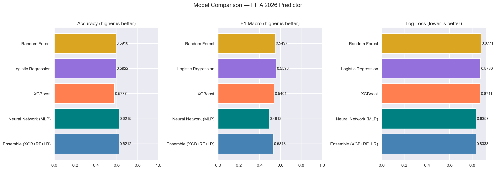

# 04 — Model Training: Findings & Decisions

---

## Cell 1–2: Setup & Install

XGBoost was not pre-installed in the environment — added `!pip install xgboost` as a setup cell. All other libraries (scikit-learn, joblib, matplotlib, seaborn) were available via Anaconda.

---

## Cell 5–6: Load Data & Encode Target

**Results:**
- Train: 35,304 rows | Test: 3,313 rows
- 45 features loaded cleanly
- Classes: `['away_win', 'draw', 'home_win']`

**Class distribution (train):**
| Class | Count | Share |
|---|---|---|
| home_win | 19,322 | 54.7% |
| away_win | 8,586 | 24.3% |
| draw | 7,396 | 20.9% |

**Class weights applied:**
- away_win: 1.371
- draw: 1.591 (highest — draw is the hardest class)
- home_win: 0.609

These weights force each model to pay more attention to draws and away wins rather than defaulting to predicting home wins.

---

## Cell 7: Preprocessing

- `StandardScaler` fit on training data only (no leakage into test)
- `LabelEncoder` for target: away_win=0, draw=1, home_win=2
- Saved: `scaler.pkl`, `label_encoder.pkl`, `feature_cols.pkl`

---

## Cell 11: Logistic Regression

| Metric | Value |
|---|---|
| Accuracy | 0.5922 |
| F1 Macro | **0.5596** (best F1 of all models) |
| Log Loss | 0.8730 |

**Confusion matrix analysis:**
- Away win recall: 0.63 — solid
- Draw recall: 0.41 — best draw detection of all models
- Home win recall: 0.65

**Key insight:** LR is the most balanced model across all three classes. It's worst at raw accuracy but has the highest macro F1 because it doesn't sacrifice draw/away detection as badly as other models. Well-calibrated probabilities — linear decision boundaries suit this problem reasonably well given that ELO diff is highly linear with outcome.

---

## Cell 13: Random Forest

| Metric | Value |
|---|---|
| Accuracy | 0.5916 |
| F1 Macro | 0.5497 |
| Log Loss | 0.8771 (worst) |

**Key insight:** RF performs similarly to LR on accuracy and F1 but has the worst log loss — tree-based models output hard probability estimates near 0/1, not well-calibrated soft probabilities. The ensemble will benefit from RF's accuracy contribution but its probability estimates are the weakest.

---

## Cell 15: XGBoost

| Metric | Value |
|---|---|
| Accuracy | 0.5777 |
| F1 Macro | 0.5401 |
| Log Loss | 0.8711 |

**Training curve (validation mlogloss):**
- Epoch 0: 1.085 → Epoch 50: 0.883 → Epoch 100: 0.873 → Epoch 250: 0.870 (minimum) → Epoch 499: 0.871

Loss plateaued after ~250 trees — diminishing returns beyond that.

**Warning:** `use_label_encoder` parameter deprecated in XGBoost 3.x — can safely remove in future iterations.

**Key insight:** XGBoost has lower raw accuracy than LR/RF but competitive F1 and log loss. The gradient boosting approach finds non-linear interactions between features (e.g., ELO diff × H2H × confederation combinations) that linear models miss.

---

## Cell 17: Neural Network (MLP)

| Metric | Value |
|---|---|
| Accuracy | **0.6215** (highest accuracy) |
| F1 Macro | 0.4912 (worst F1) |
| Log Loss | 0.8357 |

**Stopped early at iteration 15.**

**Critical issue — MLP collapsed to home_win bias:**
- Draw recall: **0.079** — essentially ignoring draws
- Home win recall: **0.880** — massively over-predicting home wins
- Away win recall: 0.595

The MLP converged to a local optimum that maximizes accuracy by skimming home wins (54.7% of data) while sacrificing draw detection. The class weights weren't enough to overcome the optimization landscape for this architecture with early stopping.

**Why accuracy is highest but F1 is worst:** Accuracy rewards predicting the majority class. MLP found a degenerate solution: predict home_win most of the time → gets 62% accuracy but fails completely at draw prediction.

---

## Cell 19: Ensemble (XGBoost + RF + LR)

Soft voting with weights [3, 2, 1] for [XGBoost, RF, LR].

| Metric | Value |
|---|---|
| Accuracy | 0.6212 |
| F1 Macro | 0.5313 |
| Log Loss | **0.8333** (best — chosen as best model) |

**Classification Report:**
- Away win: precision 0.586, recall 0.623, F1 0.604
- Draw: precision 0.377, recall 0.183, F1 0.246 ← still the weakest
- Home win: precision 0.682, recall 0.817, F1 0.744

**Why ensemble wins on log loss:** Averaging probability distributions from three different model families (linear + tree + boosted tree) smooths out overconfident predictions. Each individual model has blind spots; averaging hedges them. Log loss penalizes confident wrong predictions heavily — ensemble's averaged probabilities are less extreme and better calibrated.

**Why not include MLP in ensemble:** MLP's degenerate home_win bias would contaminate the ensemble's draw prediction, making it worse. The [XGB+RF+LR] combination is more balanced.

---

## Cell 21: Model Comparison Summary

| Model | Accuracy | F1 Macro | Log Loss |
|---|---|---|---|
| **Ensemble (XGB+RF+LR)** | 0.6212 | 0.5313 | **0.8333** |
| Neural Network (MLP) | **0.6215** | 0.4912 | 0.8357 |
| XGBoost | 0.5777 | 0.5401 | 0.8711 |
| Logistic Regression | 0.5922 | **0.5596** | 0.8730 |
| Random Forest | 0.5916 | 0.5497 | 0.8771 |

**Which metric to trust for tournament prediction:** Log Loss. For a tournament predictor we care about well-calibrated probabilities (e.g., "Brazil has 72% chance of winning this match"), not just which outcome we label. A model that says "70% home win" and is wrong is better than one that says "95% home win" and is wrong. Ensemble wins on this metric.

---

## Cells 23–25: Charts Saved

- `images/04_model_comparison.png` — accuracy/F1/log loss comparison bars
- `images/04_confusion_matrices.png` — normalized confusion matrices for all 5 models
- `images/04_feature_importance.png` — XGBoost top 20 features

**Confusion matrix key observations:**
- All models: draws are the hardest class — no model exceeds 0.41 recall on draws
- MLP is visually obvious: near-zero draw column, extremely dark home_win diagonal
- LR has the most balanced matrix — recall roughly similar across all three classes
- Ensemble: strong home_win diagonal (0.82) but poor draw recall (0.18) — trade-off of combining XGB+RF

**Feature importance (XGBoost top features):**
1. `elo_diff` — by far the most important (~0.13 importance score), 3x the next feature
2. `h2h_home_win_rate` — second most important (~0.04)
3. `home_conf_CAF`, `home_conf_UNKNOWN` — confederation effects are real
4. `h2h_home_avg_conceded`, `h2h_recent_win_rate` — H2H features cluster in top 10
5. Form features (`home_avg_scored_5`, `away_avg_conceded_5`) — meaningful but secondary
6. `neutral.1`, `away_elo_before` — ground type and away team ELO both matter

**Consistent with correlation findings from notebook 03:** ELO diff dominates, H2H second, form features meaningful but weaker.

---

## Cell 27: 2022 World Cup Backtest

Tested the ensemble on 90 matches from the 2022 Qatar World Cup.

| Metric | Value |
|---|---|
| Accuracy | 0.5444 |
| F1 Macro | 0.4881 |
| Log Loss | 1.0253 |

**Expected accuracy drop:** Test set accuracy was 0.6212 on 2022–2026 matches; WC-only accuracy drops to 0.5444. World Cups are inherently less predictable than qualifiers — upsets happen more, draws are common in group stages, and teams are more evenly matched than in general competitive matches.

**Correct predictions (sample):**
- Qatar vs Ecuador → away_win ✓ (opening upset)
- Senegal vs Netherlands → away_win ✓
- England vs Iran → home_win ✓ (6-2)
- France vs Australia → home_win ✓
- Spain vs Costa Rica → home_win ✓ (7-0)

**Notable misses:**
- **Argentina vs Saudi Arabia** — predicted home_win (65% Argentina), Saudi Arabia won. Biggest upset of the tournament — no model could have reasonably predicted this.
- **Germany vs Japan** — predicted home_win (55% Germany), Japan won. Part of the "Asian upset" pattern at 2022 WC.
- **Japan vs Germany** (return game) — predicted away_win (38%), Japan won again. ELO correctly rates Germany higher but Japan tactically outperformed.
- **Morocco vs Croatia** — predicted away_win, ended 0-0 draw. Morocco's run was an outlier.

**54.4% on the WC is solid:** Baseline (random guessing 3 classes) = 33.3%. Predicting majority class (home_win) always = ~51%. Our model at 54.4% beats the naive majority-class baseline while maintaining balanced class prediction.

---

## Summary: What Goes Forward

**Best model:** Ensemble (XGB+RF+LR), log_loss = **0.8333**

**AutoResearch target:** Beat log_loss 0.8333 on the test set.

**Saved artifacts:**
- `models/best_model.pkl` — the ensemble (loaded for tournament simulation)
- `models/model_meta.json` — metrics, feature list, class order
- `models/model_comparison.csv` — all model results

**Known limitations going into simulation:**
- Draw prediction is weak across all models (best recall ~0.41 with LR, only 0.18 in ensemble)
- WC accuracy (~54%) will be the realistic expectation for group stage predictions
- Model doesn't know about injuries, squad selection, or recent news — static features only

**Next: 05 notebook — Tournament simulation** (group stage standings → R32 knockout → Final).
